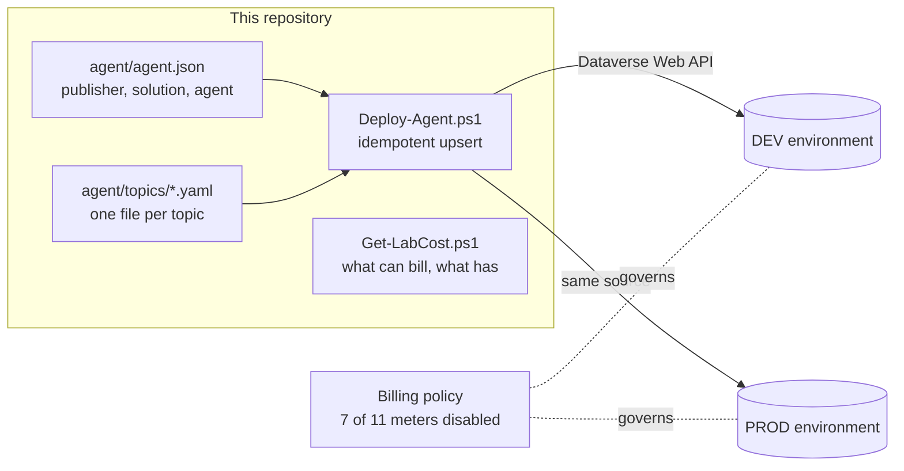

# Copilot Studio ALM

A Copilot Studio agent defined as **source**, not clicked together in a designer, and promoted from dev to prod by a script that reports what it will change before it changes it.

The interesting constraint is that Copilot Studio is a low-code product. Its agents are authored in a web UI, which normally leaves you with no diff, no review, no history, and no way to tell whether two environments actually match. This lab treats the designer as a rendering of source that lives in git, because agents are stored in Dataverse as ordinary rows: a `bot` record and a set of `botcomponent` rows holding topic YAML. Those rows can be written through the Dataverse Web API, so the whole thing is reachable from code.



## What this demonstrates

| Area | How it's done here |
|---|---|
| **Low-code under source control** | The agent, its solution, its publisher and every topic are files. The environment is made to match them, never the reverse. |
| **Idempotent deployment** | Each object is compared before it is written. A second run reports `Unchanged` and writes nothing: 4 seconds against 24 for the first. |
| **Drift detection** | Edit one topic and the plan shows exactly one `WouldUpdate` against four `Unchanged`. Remediation touches that component only. |
| **`-WhatIf` that means something** | The plan runs against a real environment and writes nothing. Verified on an empty environment: 5 planned, 0 written. |
| **Cost control by construction** | The pay-as-you-go billing policy enables 4 meters and disables 7. A premium flow run cannot bill $0.60 because that meter is switched off, not because nobody ran one. |
| **Tenant realism** | Built in a tenant with no Power Platform licences and zero Dataverse capacity, which is what pay-as-you-go exists to solve. |

## Repository layout

```
agent/
  agent.json            Publisher, solution and agent identity
  topics/*.yaml         One file per topic; this is the source of truth
scripts/
  Deploy-Agent.ps1      Idempotent upsert into a target environment
  Get-LabCost.ps1       What can bill, and what has
```

## How to run it

**Prerequisites:** Azure CLI, an Azure subscription, and tenant admin rights to create a Power Platform billing policy.

```powershell
# Plan against an environment without changing it
./scripts/Deploy-Agent.ps1 -InstanceUrl https://yourorg.crm.dynamics.com/ -WhatIf

# Apply
./scripts/Deploy-Agent.ps1 -InstanceUrl https://yourorg.crm.dynamics.com/

# Promote the same source to production
./scripts/Deploy-Agent.ps1 -InstanceUrl https://yourprod.crm.dynamics.com/

# What can bill, and what has
./scripts/Get-LabCost.ps1
```

## Cost

Pay-as-you-go, billed to an Azure subscription through a billing policy. There is no monthly commitment; the $200 capacity pack is not required.

| Meter | Rate | State here |
|---|---|---|
| Copilot Studio credits | $0.01 per credit | enabled, the only thing that accrues |
| Dataverse database / file | $48 and $2.40 per GB/month, first 1 GB free per environment | enabled, never reached |
| Dataverse log | $12 per GB/month, **no free tier** | enabled, but auditing is off so it stays at zero |
| Power Automate premium flow runs | $0.60 per run | **disabled** |
| Attended / unattended RPA | $3.00 per run | **disabled** |
| Power Apps per-app | $10 per user/app/month | **disabled** |
| Power Pages, Windows 365 | various | **disabled** |

Meters default to off when a policy is created. Leaving the expensive ones off is the guardrail: the cheapest way to not spend $0.60 a run is to make that meter incapable of billing. Building and verifying this lab cost under two cents.

Dataverse deserves a note. The free grant is per pay-as-you-go environment, not per tenant, so two environments carry 1 GB each. The log meter is the trap: it has no free tier and bills immediately, but only consumes when auditing is enabled, which is off by default and verified here rather than assumed.

## Design decisions

- **Rows, not clicks.** Agents live in Dataverse as `bot` and `botcomponent` records, so a publisher, solution, agent and topics can all be created through the Web API. That is what makes the designer optional and source control possible.
- **Compare before writing.** Topic YAML is compared against what is deployed. The script distinguishes `Created`, `Updated`, `Unchanged` and the `Would*` variants, so a run is a report as much as an action.
- **The billing policy is part of the infrastructure.** Which meters are enabled is a deployed decision, recorded and reviewable, not an afterthought in a portal.

### A bug worth recording

`Deploy-Agent.ps1` originally hung forever on its first write, with no error and no timeout. Reads worked; writes did not.

The cause was `Get-Content -Raw`. It does not return a plain string: it returns one decorated with ETS note properties including `PSDrive` and `PSProvider`, which are objects with deep, self-referential graphs. Passing that string into a hashtable and calling `ConvertTo-Json -Depth 10` sends the serializer walking into them, and it never returns. Reads never hit it because only writes build a request body.

The fix is `[System.IO.File]::ReadAllText()`, which returns an undecorated string. The value looks identical, prints identically, and has the same `Length`. Only the serializer can tell the difference.

## Part of a series

More at [ziyaduqdah.com](https://ziyaduqdah.com/#labs).
